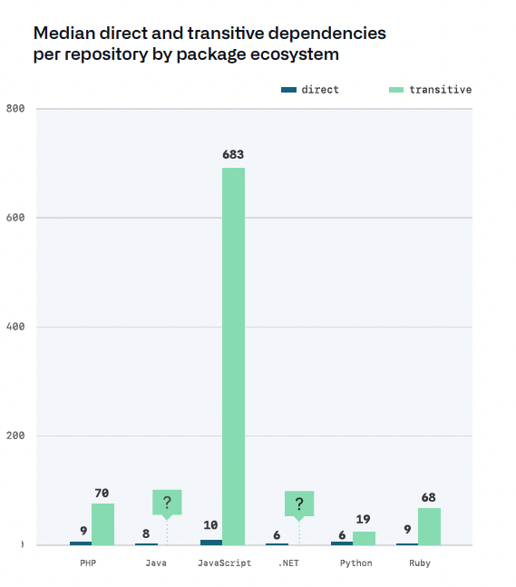

Several Linux distros were recently compromised by a mega-hack that almost became the biggest exploit of all time before it was discovered, but what does this mean for you and your team?

<!-- end -->

## A summary of the mega-hack

A vulnerability tagged [CVE-2024-3094](https://access.redhat.com/security/cve/CVE-2024-3094) has surfaced in XZ Utils, an open-source library used in all the main linux distros. The glitch traces back to some shady code sneaked in by one of the maintainers. This rogue dev managed to install a personal backdoor that would allow remote code execution at the OS level, which is essentially total access. The plot thickens as the culprit infiltrated the XZ project under the guise of a contributor nearly two years back, gradually earning enough trust to land maintainer duties :astonished: Such sneaky maneuvers typically scream state-sponsored hackery, though this remains unproven. [Fireship did an amazing video on this if you are interested](https://www.youtube.com/watch?v=bS9em7Bg0iU)

## Why was this so dangerous?

The majority of web applications on the internet runs on Linux, and this code made its way into early versions of all the major Linux distros. It was only caught by accident, but it had the potential to give the attacker OS level code access to most of the machines on the internet! :boom: THankfully it was caught by a developer doing some performance benchmarking on pre-release Linux versions

## What impact does this have on the software industry?

This draws into question the integrity of the open source model that has powered most software development for the last 20 years. If Linux can be hacked by a contributor to a very minor package, what about the other 100s of packages we rely on at every level of our systems?

## So what implications does this have for my dev team?

Abandoning the open source model is not practical for most, but there are some practical steps you can take to reduce your chances of being in the blast radius of any future instances of rogue contributor attacks

#### 1. Avoid the bleeding edge

As new versions of packages are released and get adopted, they come under increasing levels of scrutiny. Staying away from beta versions, pre release versions, and early major versions of package (i.e. lean towards 1.9.999 instead of 2.0.0). If you have an app serving a highly regulated industry, or one where user data is confidential, the risks outweigh the rewards. This can also help you avoid new bugs that are sometimes introduced in major version releases, but that get fixed in minor ones.

#### 2. Keep your dependencies to only what is necessary

Treat every package as if it has a maintenance overhead for your team, only adding what is strictly necessary. Avoid niche packages, as these are the most likely to be poorly maintained, and vulnerable to this sort of insider action. A side benefit of this is that it keeps [package bloat](https://spectrum.ieee.org/lean-software-development) to a minimum

#### 3. Avoid languages/frameworks that bring a forest of dependencies

Anyone already committed to a javascript backend, do not look at the below diagram (Source: github octoverse report 2020)

For me this reenforces an existing philosophy of mine: JS belongs in unsecure environments (like the browser), not in a backend (or at least ones which handle sensitive information).

#### 4. Patch known vulnerabilities

Use dependabot, or whatever tooling you need. Just do it