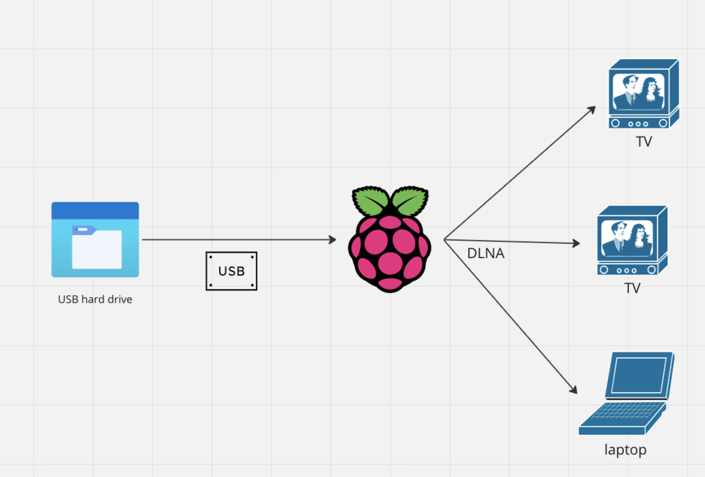

Everyone loves Raspberry Pi, they are cheap and flexible mini linux boxes. Here is a how I set one up to serve video files to all of the devices in my house.

<!-- end -->


# How it works



I use a Raspberry Pi with [ReadyMedia/miniDLNA](https://sourceforge.net/projects/minidlna/) to serve files to all the smart devices in my home. Most modern smart TVs support DLNA, so the beauty of this is that no additional app is needed, you can just use the native video player on the TV (both my TVs are older LG smart TVs, and this works excellently).

It serves the files over the local network (ethernet in my case, but it works great with wifi also).

FYI: miniDLNA has had a name change to 'readyMedia', which I believe down to the DLNA name being owned by a [non profit organisation](https://www.dlna.org/). I use miniDLNA in most of the instructions, as that is what the package & service are still called!


## The benefits 

ReadyMedia/miniDLNA is 
- Small
- Fast
- Configurable
- Free!

Also it does not transcode or otherwise mess with your video files.

The above means I can have it running all the time on my pi and not worry about electricity consumption. It also doesn't access the disk unnecessarily, so if it is a spinning disk that means less wear and tear.

In short, unless you are planning on serving files outside your home, then I believe this is the superior option.


# Step by Step guide

Before you start, I am assuming you have
- A raspberry pi, already with an OS installed, and connected to your wifi or ethernet network (if not, there is [a guide here](https://www.raspberrypi.com/documentation/computers/getting-started.html))
- Some sort of external storage to plug into it
- I recommend you set up ssh access to execute all these commands remotely. This is pretty much essential to run a Pi headless (with no keyboard or monitor attached), which is how most people would want to run their media server
    - [Here is how to do that](https://www.onlogic.com/eu/blog/how-to-ssh-into-raspberry-pi/)
    - if you need a SSH client, I recommend [Termius](https://play.google.com/store/apps/details?id=com.server.auditor.ssh.client&hl=en&pli=1) for Android, putty for PC, or just [the built in client on Mac](https://www.servermania.com/kb/articles/ssh-mac)


## Mounting a USB drive for sharing

Unless your video collection is very small, it is likely you will want to mount some sort of external storage to your PI to host the files. Here is how to do that.

First run the below command, after plugging in your external drive

```
sudo fdisk -l
```


We need to have our media drive to be mounted on startup so that we can access its contents. To do this we are going to need to make a folder to mount it to. You can do that by using this command:
```
sudo mkdir /media/HDD
```
What this command does is makes a folder called HDD in the media directory. So once we have made this folder we need to give it read write permissions. We can do this by using this command:

```
sudo chmod 774 /media/HDD
```
This command command grants full access to root users, and read to others (this is slightly more secure than chmod 777)

Now we need to edit the fstab file. This is the file that the raspberry pi operating system refers to when it is looking to see which dives to mount at startup so we need to put our media drive in that file. We can do that by using the command:

```
sudo nano /etc/fstab
```

Once in this file you will notice that it is not the same as Microsoft Word which you might be familiar to. You need to use the arrow keys to navigate around. So go to the bottom of this file and you are going to add this line:

```
/dev/sda1    /media/HDD   vfat    defaults     0        2
```

Ok so the line that you just added might be a bit confusing so I will try to explain it. The first part where is says /dev/sda1 is the is the name of the hard drive that you want to add. Remember from the previous step. The next part is the place where you are going to mount it to. Then we have the format of the hard drive. In this case it is vfat. And finally the 0 and 2 at the end are permissions.

Important step! At this stage it is a good idea to test out this config before restarting, this way you know you won't corrupt your pi and have to wipe the SD card. 

```
sudo mount -a
```
If this runs ok, then you are good to restart, if not, you should look again at what you have entered into /etc/fstab

Now it you reboot the raspberry pi:
```
sudo reboot
```
and move into the directory /media/HDD
```
cd /media/HDD
```
And run this command:
```
ls
```
You should be able to see all the files on your hard drive.


## Setting up miniDLNA/ReadyMedia for sharing


You will now have to edit the configuration file associated with your media server. Once again you're going to do this via the text editor that's part of your Pi's installation. Execute the following command:
```
sudo nano /etc/minidlna.conf
```
which should load the minidlna.conf file into the editor.

Search through the file and look for the part where you see this:
```
# * "A" for audio (eg. media_dir=A,/var/lib/minidlna/music)
# * "P" for pictures (eg. media_dir=P,/var/lib/minidlna/pictures)
# * "V" for video (eg. media_dir=V,/var/lib/minidlna/videos)
```
Edit that part so that it ends up like this:
```
media_dir=A,/media/HDD/Music
media_dir=P,/media/HDD/Pictures
media_dir=V,/media/HDD/Movies
```
Then look for this part:


```
# Name that the DLNA server presents to clients.
#friendly_name=
```
and change it to:

```
# Name that the DLNA server presents to clients.
friendly_name=RASPI MINIDLNA
```
Know that you can use whatever name you want here. I'm not sure if there's a requirement for the name being in upper-case letters, nor if any punctuation (other than the space character) is allowed. I'd err on the side of caution here!

Once again, press Ctrl-X to close the editor and choose to save the file (and buffers) when prompted.

Now that we've rewritten the configuration file for the media server, we have to refresh it. To do this you can run the following commands:
```
sudo service minidlna restart 
sudo service minidlna force-reload
```

At this point, your Pi has rebooted, mounted the attached USB hard drive, and run the media server software. Because it's part of your home network - either through an Ethernet or Wi-Fi connection - it should now show up in the Network area when you're in Windows' File Manager. It'll be called RASPI MINIDLNA (or whatever you name it) and may be in the media devices section.


## Troubleshooting

### Losing access

If minidlna loses access to your files after a reboot, the mounting might be overwriting the permissions set by your chmod command. In this case we just need to update the fstab file to add the files to the minidlna group on mount

First, find your minidlna user id, and group id using this command
```
id minidlna
```
This should output something like this, where uid is the user id and gid is the group id
```
uid=110(minidlna) gid=116(minidlna) groups=116(minidlna)
```
You can then update fstab using the steps above to look something like this
```
/dev/sda1    /media/HDD   vfat    defaults,umask=003,uid=110,gid=116     0        2
```
This makes minidlna the 'owner' of the files on mount. umask gives read and write access to minidlna and any other userin the group ([details here on how to add more users](https://www.baeldung.com/linux/add-user-multiple-groups), if you want other processes to be able to write to the usb).
Once again, remember to test your mount before restarting!


## Acknowledgements

Some sources that helped me put this together

https://www.instructables.com/Creating-a-ReadyMedia-formerly-MiniDLNA-Media-Serv/

https://www.instructables.com/Raspberry-Pi-Media-Server-MiniDLNA/

