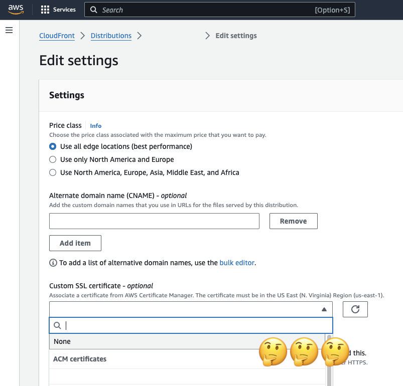

Cloudfront is an easy to use CDN for basic use cases, with blazing fast performance in most geographical areas, but this gotcha can be very frustrating. HTTPS is an almost essential requirement these days, as your site will have difficulty being listed on google without this, and you will need a SSL cert to configure HTTPS.

<!-- end -->

## The problem
Most likely you already have an SSL Certificate in AWS Certificate Manager (ACM). Then when you go to configure it in CloudFront you cannot select the radio button that says Custom SSL Certificate (example.com) or your SSL Certificate does not show in the options.

## The reason
The reason for this is that your SSL Certificate HAS be created in the N. Virginia Region (us-east-1) for it to be used in cloudfront.

## To resolve:
The easiest way is to simply 
1) Switch to us-eat-1 region in AWS console
2) Create a new certificate in [SSM](https://us-east-1.console.aws.amazon.com/acm/home?region=us-east-1#/certificates/list) for the domain in question.

## Conclusion
It is pretty silly that this issue still persists in AWS, and it does raise further questions about how fault tolerant the whole ecosystem is to an outage in Virginia... lets hope that never happens.
