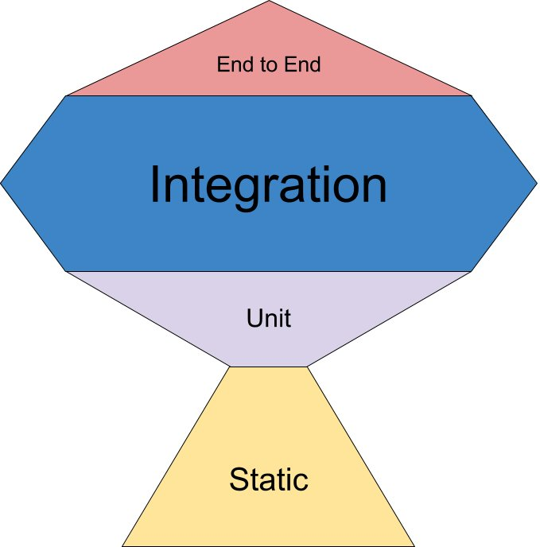

For years the concept of the testing pyramid has reigned supreme: the idea that the number of tests should be inversely proportional to the breath of their scope. In short: lots of unit tests, very few end to end tests.

This was first proposed by Mike Cohen in "Succeeding with Agile", but [really popularised by software demigod Martin Fowler](https://martinfowler.com/bliki/TestPyramid.html).

In recent times there has been a shift in thinking here, and one that I have jumped on board with for both front and backend development.

<!-- end -->

## Understanding the Testing Pyramid

The Testing Pyramid, introduced by Mike Cohn in his book "Succeeding with Agile," visualizes a hierarchical structure for software testing. At its base, it advocates for a broad foundation of unit tests, followed by a middle layer of integration tests, and finally, a narrow apex of end-to-end tests. 

The rationale behind this model is to prioritize the faster and more granular unit tests over slower and more brittle end-to-end tests. This approach aims to catch defects early in the development process and reduce the cost of fixing them.

This philosophy has been widely adopted, and has most likely saved thousands of dev teams from the slow painful velocity killer of a top heavy suite of UI/end to end tests.

## Where the Testing Pyramid could be better

While sticking strictly to the test pyramid approach will achieve its main goals of encouraging you to do more of your testing in the less brittle and lower maintenance parts of your testing stack, there has been some developments that have changed things, namely docker.

Docker (and other containerisation solutions) makes it easy and efficient to spin up a canned environment that consists of multiple pieces of infra, for example a app server, a db and a message queue. This lowers the cost and time for tests in the middle part of the pyramid, while still making it easy for them to be deterministic (and reliable), as you are starting with a clean env each time. There are also some tools for frontend development that have emerged that facilitate wider scope testing there also (more on that in another blog).

The test pyramid also fails to acknowledge that there can be some serious pain in getting high levels of test coverage in codebases simply using a unit test approach (anyone who has tested code based a DB ORM such as SqlAlchemy or Hibernate will know about this). There are also high levels of pain to be experienced in frontend codebases with mocking of REST requests, etc. Of course, people build up extensive mock libraries and other coping methods, but could this code be tested in a better way?

## Introducing the Testing Trophy

In response to the development of the above, Kent C. Dodds introduced the [Testing Trophy model](https://kentcdodds.com/blog/the-testing-trophy-and-testing-classifications). In this, he proposes a greater emphasis on integration testing. He is mainly concerned with Javascript (not surprising, as he is the author of the React Testing Library), but the theory applies to any language. 

The difference here is subtle: unit tests are still great, and useful, but integration tests have a greater return for the time spent.

## My experience

Reading Kent's blog post was a very affirmative experience for me. In my backend development I have been unconsciously drifting towards a practice where I am almost always writing integration tests, and mainly using unit tests to get coverage in any areas of special intricacies or dense logic. Unit tests are still unbeatable in these areas for fast feedback, and for driving a ['red-green-refactor' approach, as promoted by Robert C. Martin](https://blog.cleancoder.com/uncle-bob/2014/12/17/TheCyclesOfTDD.html).

## Conclusion

While the Testing Pyramid laid the groundwork for modern software testing practices, the Testing Trophy represents an important evolution in this space. It is also an example of how we should not be afraid to reevaluate the 'sacred cows' of software development, as the landscape evolves.